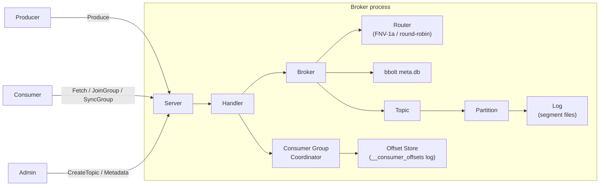

# Mini-Kafka

> A from-scratch implementation of a durable, partitioned pub/sub system in Go — segment files, sparse index, CRC validation, custom binary TCP protocol, partition routing, consumer groups with range assignment, and bbolt-backed metadata persistence. No Kafka client library used.

[](https://github.com/Utkarsh272/mini-kafka/actions)
[](https://go.dev)
[](LICENSE)

[What's built](#whats-built) · [Architecture](#architecture) · [Wire protocol](#wire-protocol) · [Quick start](#quick-start) · [Design decisions](#design-decisions) · [Roadmap](#roadmap)

---

## What & Why

Most engineers use Kafka. Very few have built one.

Mini-Kafka is a ground-up implementation of the core Kafka primitives — not a wrapper, not a toy that stops at "here's a queue." Every byte on disk, every field in the wire protocol, every routing decision, and every consumer group state transition is written from scratch.

The goal: understand the exact engineering decisions behind one of the most influential pieces of distributed infrastructure in modern software, by implementing it.

**What this is not**: a production Kafka replacement. The point is depth of understanding, correctness, and clarity of implementation.

---

## What's Built

### Storage layer (`internal/storage`)

The append-only log that everything else sits on.

- **Segment files** — each partition is a directory of `.log` + `.index` file pairs named by their base offset (`00000000000000000000.log`). Segments roll at 1 MB.
- **Sparse index** — one index entry per 512 bytes of log data, format `[relativeOffset: 4B][bytePosition: 4B]`. Reads binary-search the index to find the nearest position, then scan forward to the exact offset — O(log n) seek, O(1) scan.
- **CRC32 validation** — every record carries a CRC32/IEEE checksum over its payload. Computed on write, validated on every read. Corrupted records return an error rather than silently serving bad data.
- **Recovery on reopen** — `OpenLog` scans existing `.log` files to recover `nextOffset` without a separate WAL.
- **`WriteAt`-based appends** — no `O_APPEND` flag. Byte position tracked explicitly so reads and writes safely share the same file descriptor under a mutex.

**Record format** (binary, big-endian):
```
[length: 4B][offset: 8B][timestamp: 8B][crc32: 4B][key_len: 4B][key][value_len: 4B][value]
```

### Broker layer (`internal/broker`)

- **Partition routing** — keyed records use FNV-1a hash (`hash(key) % numPartitions`), giving stable per-key routing that preserves ordering. Keyless records round-robin via a per-topic `atomic.Uint64` counter — lock-free for concurrent producers.
- **Metadata persistence** — topic configs (name, partition count, replication factor) stored in an embedded [bbolt](https://github.com/etcd-io/bbolt) database. On startup, topics are replayed from bbolt and partition logs reopened — no data loss across restarts.

### Consumer groups (`internal/consumer_group`)

Full implementation of the Kafka consumer group protocol:

- **State machine** — `Empty → PreRebalance → AwaitingSync → Stable`. Each transition is correct and tested.
- **JoinGroup** — connection goroutine parks inside the coordinator (exactly like Kafka) during a 500ms rebalance delay window that collects all joining members before closing the phase.
- **SyncGroup** — leader submits assignment or lets the coordinator auto-compute it via the range assignor. All members park until the leader's call flushes assignments.
- **Range assignor** — assigns `⌈partitions / members⌉` contiguous partitions per topic. Deterministic (sorted member IDs). Handles more members than partitions correctly.
- **Heartbeat** — validates generation ID, refreshes last-seen timestamp. Returns `REBALANCE_IN_PROGRESS` during active rebalances.
- **LeaveGroup** — removes member and triggers a new rebalance if group was Stable.
- **Background reaper** — evicts members that miss their session timeout every 3 seconds.
- **Durable offset store** — committed offsets written to an internal append-only log (`__consumer_offsets`). Replayed on startup so committed positions survive broker restarts.

### Wire protocol (`internal/protocol`)

Custom binary protocol over TCP. All integers big-endian.

```
Request:  [length: 4B][api_key: 1B][correlation_id: 4B][client_id_len: 2B][client_id][payload]
Response: [length: 4B][correlation_id: 4B][error_code: 2B][payload]
```

Implemented API keys:

| Key | Name |
|-----|------|
| 0 | Produce |
| 1 | Fetch |
| 2 | Metadata |
| 3 | JoinGroup |
| 4 | SyncGroup |
| 5 | Heartbeat |
| 6 | OffsetCommit |
| 7 | OffsetFetch |
| 9 | LeaveGroup |
| 10 | CreateTopic |
| 11 | DescribeGroup |

Planned: `FetchFollower(8)` (replication, Days 10–12)

### TCP server (`internal/server`)

- **Goroutine-per-connection** with `bufio` buffering on both read and write paths.
- **Auto-routing on Produce** — `partitionID = -1` tells the broker to route using key hash or round-robin.
- **Correlation IDs** — every request carries a `correlation_id` echoed in the response, enabling client-side request pipelining.
- **Graceful shutdown** via `sync.WaitGroup` on all active connection goroutines.

---

## Architecture



### On-disk layout

```
<data-dir>/
├── meta.db                          # bbolt: topic configs
├── __consumer_offsets/              # durable committed offset log
│   ├── 00000000000000000000.log
│   └── 00000000000000000000.index
├── orders-0/                        # topic "orders", partition 0
│   ├── 00000000000000000000.log
│   ├── 00000000000000000000.index
│   └── ...
└── orders-1/
    └── ...
```

---

## Wire Protocol

### Produce (partitionID = -1 → broker routes)
```
acks: int16 | timeout_ms: int32 | topic_count: int32
  topic: string | part_count: int32
    partition: int32  (-1 = auto-route)
    rec_count: int32
      key_len: int32  (-1 = null → round-robin) | key: bytes
      val_len: int32 | val: bytes
```

### JoinGroup
```
group_id: string | session_timeout: int32 | member_id: string
topic_count: int32 | topic: string ...
```

### SyncGroup
```
group_id: string | generation_id: int32 | member_id: string
assign_count: int32
  member_id: string | topic_count: int32
    topic: string | part_count: int32 | partition: int32 ...
```

---

## Quick Start

```bash
git clone https://github.com/Utkarsh272/mini-kafka
cd mini-kafka

# Build
go build -o bin/broker ./cmd/broker

# Start a broker
./bin/broker --addr :9092 --data-dir /tmp/mini-kafka --node-id 1

# Test
go test ./...
go test -race ./...
```

See `internal/server/server_test.go` for a complete wire-protocol client with helpers for every API — the canonical way to interact with the broker until the CLI ships in Day 15.

---

## Testing

| Package | Coverage |
|---------|----------|
| `internal/storage` | Encode/decode, CRC corruption detection, segment append/read/reopen, log rolling, cross-segment reads, 10K record volume |
| `internal/broker` | Hash stability, round-robin distribution, topic CRUD, metadata persistence across restarts, LEO recovery |
| `internal/consumer_group` | Full Join+Sync cycles, range assignor (1/2/3 members, more members than partitions), heartbeat validation, leave+rebalance, offset persistence across restarts |
| `internal/server` | TCP integration — CreateTopic, Produce (explicit + auto-route), Fetch, Metadata, OffsetCommit/Fetch, DescribeGroup, correlation ID mirroring |

```bash
go test ./...        # all packages
go test -race ./...  # with race detector
go test -short ./... # skip large volume tests
```

---

## Design Decisions

### Why `WriteAt` instead of `O_APPEND`?

`O_APPEND` is POSIX-atomic but the kernel ignores any preceding `Seek` — every write goes to EOF regardless. `WriteAt` with an explicit tracked position is equally safe under a mutex, and lets tests corrupt specific byte offsets to validate checksum detection.

### Why FNV-1a for key routing?

Same algorithm as Kafka's `DefaultPartitioner`. Fast, good distribution, and the same key always maps to the same partition regardless of which producer instance computes it — the property that gives per-key ordering guarantees.

### Why block the connection goroutine in JoinGroup?

This is exactly what Kafka does. The connection goroutine parks inside `Coordinator.JoinGroup` for the duration of the rebalance delay. The alternative (async callbacks) would require a complex response-routing layer with no benefit — the client is already blocked waiting for the response anyway.

### Why auto-compute assignment when SyncGroup has empty assignments?

Simplifies client implementation significantly. Real Kafka requires the leader to compute and send the full assignment. Here, the leader can send an empty list and the coordinator runs the range assignor — useful for tests and simple clients that don't want to implement the assignor themselves.

### Why a separate offset log instead of bbolt?

Offset commits are high-frequency writes. An append-only log is O(1) per commit and never requires random writes. bbolt would need a write transaction per commit, adding B+ tree overhead. The log is replayed forward on startup — the latest record per key wins.

### Why `openTopic` before `metadata.saveTopic`?

If the broker crashes between the two calls, orphaned log directories exist but bbolt has no record — harmless on next startup. The reverse (save first) would cause replay to fail if directories weren't created yet, which is harder to recover from.

---

## Roadmap

| Days | Goal | Status |
|------|------|--------|
| 1–2 | Segment files, sparse index, CRC, Log API | ✅ |
| 3–4 | Wire protocol, TCP server, Produce/Fetch/Metadata | ✅ |
| 5–6 | Partition routing, bbolt metadata persistence | ✅ |
| 7–9 | Consumer groups, range assignor, durable offset store | ✅ |
| 10–12 | ISR replication: FetchFollower loop, high-watermark | 🔲 |
| 13–14 | Multi-broker Docker Compose cluster | 🔲 |
| 15 | CLI: `mk produce`, `mk consume`, `mk topics`, `mk groups` | 🔲 |
| 16–17 | Next.js + TypeScript dashboard | 🔲 |
| 18 | Prometheus metrics, load benchmark, DESIGN.md | 🔲 |

---

## Tech Stack

| Layer | Choice |
|-------|--------|
| Language | Go 1.23 |
| Storage | `os.File` + custom binary serialization |
| Metadata | `go.etcd.io/bbolt` |
| Wire protocol | Custom binary TCP |
| Dashboard (planned) | Next.js + TypeScript + Recharts |
| Metrics (planned) | `prometheus/client_golang` |

---

## License

MIT
