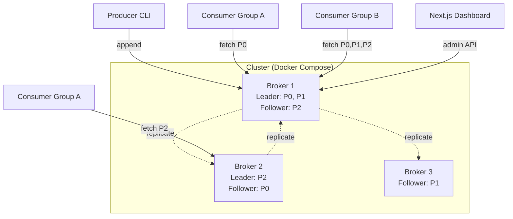

# Mini-Kafka

> A from-scratch durable, replicated, partitioned pub/sub system in Go. Implements the core Kafka design from the original LinkedIn paper — segment files, ISR replication, consumer groups — without using the Kafka client library.

[](https://github.com/Utkarsh272/mini-kafka/actions)
[](https://go.dev)
[](LICENSE)

[Architecture](#architecture) · [Design notes](DESIGN.md) · [Benchmarks](#benchmarks) · [Quick start](#quick-start) · [Status](#status)

---

## What & Why

Most engineers use Kafka. Very few have built one.

Mini-Kafka is a ground-up implementation of the core Kafka primitives — not a wrapper, not a tutorial project that stops at "here's an append-only log." It's a multi-broker cluster with a wire protocol, ISR replication, and consumer group coordination, running in Docker Compose.

The goal: understand the exact decisions behind one of the most influential pieces of infrastructure in modern software, by building it from zero.

**What this is not**: a production Kafka replacement. The point is depth of understanding, not feature parity.

---

## Roadmap

> **Status**: 🏗️ Active development — ~18 days total. See [day-by-day plan](#day-by-day-plan) below.

| # | Milestone | ETA | Status |
|---|-----------|-----|--------|
| 1 | Single-broker append-only log with segment files + index | Week 3 | 🔲 |
| 2 | Wire protocol (binary TCP) + Produce/Fetch/Metadata | Week 3 | 🔲 |
| 3 | Multiple topics and partitions | Week 4 | 🔲 |
| 4 | Consumer groups + rebalancing (JoinGroup/SyncGroup/Heartbeat) | Week 4 | 🔲 |
| 5 | Leader-follower replication + ISR tracking + high-watermark | Week 5 | 🔲 |
| 6 | Multi-broker cluster (Docker Compose, 3 brokers) | Week 5 | 🔲 |
| 7 | CLI tool: `mk produce`, `mk consume`, `mk topics`, `mk groups` | Week 5 | 🔲 |
| 8 | Next.js + TypeScript dashboard (lag, offsets, ISR status) | Week 5 | 🔲 |
| 9 | Prometheus metrics + Grafana + load benchmark | Week 5 | 🔲 |

---

## Architecture



### On-disk layout

Each partition is a directory of segment files:

```
/data/<topic>-<partition>/
├── 00000000000000000000.log      # Segment named by base offset
├── 00000000000000000000.index    # Sparse offset → byte position (mmap'd)
├── 00000000000000010000.log      # Next segment (rolled at 1 MB)
└── 00000000000000010000.index
```

**Log record format** (binary, big-endian):
```
[length: 4B][offset: 8B][timestamp: 8B][crc32: 4B][key_len: 4B][key][value_len: 4B][value]
```

### Wire protocol

Custom binary protocol over TCP — no Kafka client compatibility, but exposes the same conceptual API surface:

```
Request:  [length: 4B][api_key: 1B][correlation_id: 4B][client_id_len: 2B][client_id][payload]
Response: [length: 4B][correlation_id: 4B][error_code: 2B][payload]
```

API keys: `Produce(0)`, `Fetch(1)`, `Metadata(2)`, `JoinGroup(3)`, `SyncGroup(4)`, `Heartbeat(5)`, `OffsetCommit(6)`, `OffsetFetch(7)`, `FetchFollower(8)`, `LeaveGroup(9)`, `CreateTopic(10)`, `DescribeGroup(11)`

---

## Key Algorithms (implemented from scratch)

### Append path
1. Acquire partition write mutex
2. Assign `nextOffset = logEndOffset + 1`, encode record, `writev` to active segment
3. Update sparse index every 4 KB; roll segment at 1 MB
4. fsync behavior driven by `acks` setting: `0` = none, `1` = leader disk, `-1` = wait for ISR

### Read path
1. Binary search segment list by base offset
2. Binary search `.index` file (mmap'd) for nearest entry
3. Linear scan forward to exact offset
4. Cap at `high-watermark` — consumers never see uncommitted records

### Consumer group rebalance
- Group leader (first member) runs `range_assignor` — assigns contiguous partitions per topic
- State machine: `Empty → PreRebalance → AwaitingSync → Stable`
- Members removed from group on missed heartbeat; reassignment triggered

### ISR replication
- Each follower has a persistent `FetchFollower` loop pulling from leader
- Leader tracks `(follower_offset, last_fetch_time)` per ISR member
- Follower evicted from ISR if lag > `replica.lag.records.max` or time > `replica.lag.time.max`
- `high-watermark = min(logEndOffset across ISR)`

---

## Benchmarks

> *These will be filled in at project completion. Targets below are design goals.*

| Metric | Target | Notes |
|--------|--------|-------|
| Single broker, 1 partition | ≥ 100K msg/sec | 1 KB messages, `acks=1` |
| 3-broker, 6 partitions, RF=2 | ≥ 250K msg/sec | Aggregated throughput |
| p99 end-to-end latency @ 100K msg/sec | ≤ 15 ms | Producer → consumer |

---

## Day-by-day Plan

| Days | Goal |
|------|------|
| 1–2 | Segment files: `.log` + `.index`, `Append` + `Read` API, 10K record smoke test |
| 3–4 | TCP server: framing, `Produce` / `Fetch` / `Metadata` handlers, goroutine-per-connection |
| 5–6 | Topics + partitions: hash/round-robin routing, `CreateTopic`, bbolt metadata |
| 7–9 | Consumer groups: `JoinGroup`, `SyncGroup`, `Heartbeat`, range assignor, offset store |
| 10–12 | Replication: `FetchFollower` loop, ISR tracker, high-watermark, read-committed |
| 13–14 | Multi-broker cluster: Docker Compose 3-broker, static leader assignment, health checks |
| 15 | CLI: `mk produce`, `mk consume`, `mk topics`, `mk groups` |
| 16–17 | Next.js + TypeScript dashboard: lag, ISR status, msgs/sec charts |
| 18 | Prometheus metrics, Grafana dashboard, load benchmark, README + DESIGN.md |

---

## Tech Stack

| Layer | Choice | Why |
|-------|--------|-----|
| Core broker | Go 1.22 | Goroutine-per-connection scales naturally; stdlib networking is excellent |
| Wire protocol | Custom binary TCP | The whole point — designing the protocol is the learning |
| Storage | Direct `os.File` + custom serialization | No abstraction; understand every byte |
| Metadata | `go.etcd.io/bbolt` (embedded BoltDB) | No external deps; fast for read-mostly metadata |
| mmap | `golang.org/x/exp/mmap` | For index file random access |
| Dashboard | Next.js + TypeScript + Recharts | Adds TypeScript surface to portfolio |
| Metrics | `prometheus/client_golang` | Standard |
| Testing | `testing` + `testcontainers-go` | Real integration tests against real brokers |

---

## Quick Start

> *Coming when implementation is complete.*

```bash
# Clone and spin up a 3-broker cluster
git clone https://github.com/Utkarsh272/mini-kafka
cd mini-kafka
make demo      # spins up Docker Compose cluster in ~30 seconds

# Produce 100K messages
./mk produce my-topic --partitions 3 --messages 100000 --size 1024

# Consume from beginning
./mk consume my-topic --group my-group --from-beginning

# Inspect lag
./mk groups describe my-group
```

---

## Design Decisions

Full trade-offs in [DESIGN.md](DESIGN.md) (written at project completion). Preview:

- **Why 1 MB segment files?** Kafka defaults to 1 GB; 1 MB makes rotation observable in tests. Production would tune up.
- **Why no incremental cooperative rebalancing?** Stop-the-world is sufficient for the group sizes tested. Documented as known limitation.
- **Why no ZooKeeper/etcd for leader election?** Static priority list at config time — acceptable simplification for portfolio scope. A production cluster would use KRaft.
- **Why custom wire protocol instead of Kafka-compatible?** Protocol design is the learning objective. Kafka compatibility would require implementing 40+ API versions.

---

## Project Context

This is Project 2 of a [4-project portfolio](https://github.com/Utkarsh272) built over 10 weeks, targeting backend/distributed systems engineering roles. Project 1 — [RAG with Grounded Citations](https://github.com/Utkarsh272/rag-grounded) — is live.

---

## License

MIT
