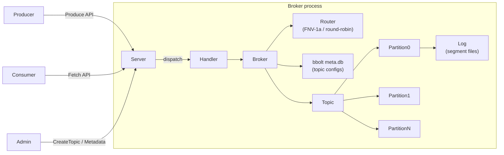

# Mini-Kafka

> A from-scratch implementation of a durable, partitioned pub/sub system in Go — segment files, sparse index, CRC validation, custom binary TCP protocol, partition routing, and bbolt-backed metadata persistence. No Kafka client library used.

[](https://github.com/Utkarsh272/mini-kafka/actions)
[](https://go.dev)
[](LICENSE)

[What's built](#whats-built) · [Architecture](#architecture) · [Wire protocol](#wire-protocol) · [Quick start](#quick-start) · [Design decisions](#design-decisions) · [Roadmap](#roadmap)

---

## What & Why

Most engineers use Kafka. Very few have built one.

Mini-Kafka is a ground-up implementation of the core Kafka primitives — not a wrapper, not a toy that stops at "here's a queue." Every byte on disk, every field in the wire protocol, and every routing decision is written from scratch.

The goal: understand the exact engineering decisions behind one of the most influential pieces of distributed infrastructure in modern software, by implementing it.

**What this is not**: a production Kafka replacement. The point is depth of understanding, correctness, and clarity of implementation.

---

## What's Built

### Storage layer (`internal/storage`)

The append-only log that everything else sits on.

- **Segment files** — each partition is a directory of `.log` + `.index` file pairs named by their base offset (`00000000000000000000.log`). Segments roll at 1 MB.
- **Sparse index** — one index entry per 512 bytes of log data. Each entry is `[relativeOffset: 4B][bytePosition: 4B]`. Reads binary-search the index to find the nearest position, then scan forward to the exact offset — O(log n) seek + O(1) scan.
- **CRC32 validation** — every record carries a CRC32/IEEE checksum over its payload fields. Computed on write, validated on every read. Corrupted records return an error rather than silently serving bad data.
- **Recovery on reopen** — `OpenLog` scans existing `.log` files to recover `nextOffset` without a separate WAL. Segments are reopened in base-offset order.
- **`WriteAt`-based appends** — no `O_APPEND` flag. Byte position is tracked explicitly in `logSize` and written via `WriteAt`, so reads and writes can safely share the same file descriptor under a mutex.

**Record wire format** (binary, big-endian):
```
[length: 4B][offset: 8B][timestamp: 8B][crc32: 4B][key_len: 4B][key][value_len: 4B][value]
```

### Broker layer (`internal/broker`)

- **Partition routing** — keyed records use FNV-1a hash (`hash(key) % numPartitions`), producing stable per-key routing that preserves ordering guarantees. Keyless records round-robin via a per-topic `atomic.Uint64` counter — zero lock contention for concurrent producers.
- **Metadata persistence** — topic configs (name, partition count, replication factor) are stored in an embedded [bbolt](https://github.com/etcd-io/bbolt) database (`meta.db`). On startup, all topics are replayed from bbolt and their partition logs reopened — topics survive broker restarts with no data loss.
- **Consumer offset tracking** — per-partition, per-group committed offsets stored in memory. `CommitOffset` / `FetchOffset` are mutex-protected. (Persistence to an internal `__consumer_offsets` topic is coming in Days 7-9.)

### Wire protocol (`internal/protocol`)

Custom binary protocol over TCP. All integers big-endian.

```
Request:  [length: 4B][api_key: 1B][correlation_id: 4B][client_id_len: 2B][client_id][payload]
Response: [length: 4B][correlation_id: 4B][error_code: 2B][payload]
```

Implemented API keys:

| Key | Name | Direction |
|-----|------|-----------|
| 0 | Produce | Producer → broker |
| 1 | Fetch | Consumer → broker |
| 2 | Metadata | Client → broker |
| 6 | OffsetCommit | Consumer → broker |
| 7 | OffsetFetch | Consumer → broker |
| 10 | CreateTopic | Admin → broker |

Planned: `JoinGroup(3)`, `SyncGroup(4)`, `Heartbeat(5)`, `FetchFollower(8)`, `LeaveGroup(9)`, `DescribeGroup(11)`

### TCP server (`internal/server`)

- **Goroutine-per-connection** — each accepted TCP connection gets its own goroutine. `bufio.Reader` / `bufio.Writer` reduce syscall overhead on both read and write paths.
- **Auto-routing on Produce** — `partitionID = -1` in a Produce request tells the broker to route using key hash or round-robin. Explicit partition IDs bypass routing.
- **Correlation IDs** — every request carries a `correlation_id` that is echoed back in the response, allowing clients to pipeline requests without head-of-line blocking.
- **Graceful shutdown** — `Server.Close()` stops the listener and waits for all in-flight connection goroutines via `sync.WaitGroup`.

---

## Architecture



### On-disk layout

```
<data-dir>/
├── meta.db                              # bbolt: topic configs survive restarts
├── orders-0/                            # topic "orders", partition 0
│   ├── 00000000000000000000.log
│   ├── 00000000000000000000.index
│   ├── 00000000000000001024.log         # rolled at 1 MB
│   └── 00000000000000001024.index
├── orders-1/
│   └── ...
└── events-0/
    └── ...
```

---

## Wire Protocol

### Produce request (partitionID = -1 → broker routes)
```
acks:           int16
timeout_ms:     int32
topic_count:    int32
  topic:        string (2B len + bytes)
  part_count:   int32
    partition:  int32   (-1 = auto-route by key)
    rec_count:  int32
      key_len:  int32   (-1 = null/keyless → round-robin)
      key:      bytes
      val_len:  int32
      val:      bytes
```

### Fetch request
```
max_wait_ms:    int32
min_bytes:      int32
max_bytes:      int32
topic_count:    int32
  topic:        string
  part_count:   int32
    partition:  int32
    offset:     int64   (fetch from here)
    max_bytes:  int32
```

---

## Quick Start

```bash
git clone https://github.com/Utkarsh272/mini-kafka
cd mini-kafka

# Build the broker binary
go build -o bin/broker ./cmd/broker

# Start a broker (data stored in /tmp/mini-kafka)
./bin/broker --addr :9092 --data-dir /tmp/mini-kafka --node-id 1

# Run all tests
go test ./...

# Run with race detector
go test -race ./...
```

### Smoke test via netcat (raw wire protocol)

A proper CLI (`mk produce` / `mk consume`) is coming in Day 15. For now, use the integration tests as the canonical client example — see `internal/server/server_test.go` for a complete `testClient` implementation with encode helpers for every API.

---

## Testing

```
internal/storage/  →  record encode/decode, CRC corruption detection,
                       segment append/read/reopen, index file creation,
                       log rolling, cross-segment reads, 10K record volume test

internal/broker/   →  FNV-1a hash stability, round-robin distribution,
                       topic create/get/list, metadata persistence across
                       restarts (LEO recovery), offset commit/fetch

internal/server/   →  full TCP integration tests — CreateTopic, Produce
                       (explicit partition + auto-route), Fetch, Metadata
                       (specific topic + all-topics), OffsetCommit/Fetch,
                       duplicate topic, correlation ID mirroring
```

```bash
go test ./...               # all packages
go test -race ./...         # with race detector
go test -v -run TestLog ... # specific test
go test -short ./...        # skip large volume tests
```

---

## Design Decisions

### Why `WriteAt` instead of `O_APPEND`?

`O_APPEND` is POSIX-atomic but makes any `Seek` + `Write` for in-place corruption testing impossible — the kernel ignores the seek and always writes to EOF. Using `WriteAt` with an explicit `logSize` position is equally correct for a single writer (mutex-protected), doesn't suffer from the seek-is-ignored problem, and lets tests corrupt specific byte offsets to validate checksum detection.

### Why FNV-1a for key routing?

Same algorithm as Kafka's `DefaultPartitioner`. Non-cryptographic, extremely fast, good distribution, and — critically — the same key always maps to the same partition regardless of which broker or producer instance computes it. This is the property that gives per-key ordering guarantees.

### Why bbolt for metadata?

Embedded, no external process, ACID transactions, and a simple bucket/key/value API that maps directly to our schema. The alternative (flat files + fsync) would require reimplementing crash recovery. bbolt's B+ tree gives O(log n) reads and a single write lock per database file — exactly right for a single-broker metadata store.

### Why store topic metadata before exposing the topic?

`CreateTopic` calls `openTopic` (creates log directories) then `metadata.saveTopic` (writes to bbolt). If the process crashes between them, orphaned log directories exist but bbolt has no record — the next startup ignores them (harmless). The reverse ordering (save to bbolt first) would cause replay to fail on restart if the directories weren't created yet, which is a harder failure to handle.

### Why round-robin for keyless records?

Even load distribution across partitions when the producer doesn't care about ordering. The atomic counter is per-topic and lock-free (`atomic.Uint64`), so concurrent producers on the same topic don't contend.

---

## Roadmap

| Days | Goal | Status |
|------|------|--------|
| 1–2 | Segment files, sparse index, CRC, Log API | ✅ Done |
| 3–4 | Wire protocol, TCP server, Produce/Fetch/Metadata/OffsetCommit | ✅ Done |
| 5–6 | Partition routing (FNV-1a + round-robin), bbolt metadata persistence | ✅ Done |
| 7–9 | Consumer groups: JoinGroup, SyncGroup, Heartbeat, range assignor | 🔲 |
| 10–12 | ISR replication: FetchFollower loop, high-watermark, read-committed | 🔲 |
| 13–14 | Multi-broker cluster (Docker Compose, 3 brokers) | 🔲 |
| 15 | CLI: `mk produce`, `mk consume`, `mk topics`, `mk groups` | 🔲 |
| 16–17 | Next.js + TypeScript dashboard (lag, ISR, msgs/sec) | 🔲 |
| 18 | Prometheus metrics, Grafana, load benchmark, DESIGN.md | 🔲 |

---

## Tech Stack

| Layer | Choice |
|-------|--------|
| Language | Go 1.23 |
| Storage | `os.File` + custom binary serialization |
| Metadata | `go.etcd.io/bbolt` (embedded BoltDB) |
| Wire protocol | Custom binary TCP (no Kafka client compat) |
| Dashboard (planned) | Next.js + TypeScript + Recharts |
| Metrics (planned) | `prometheus/client_golang` |

---

## License

MIT
